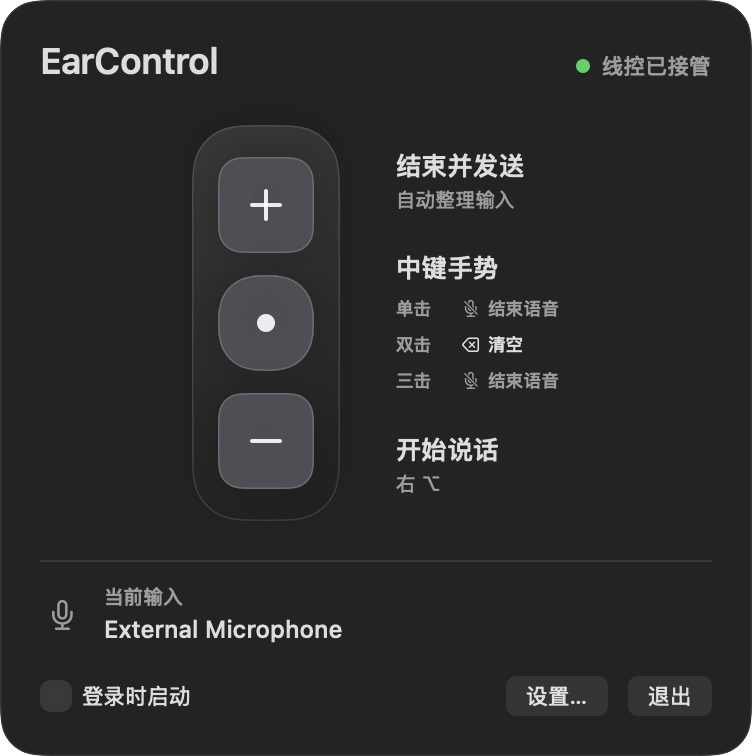
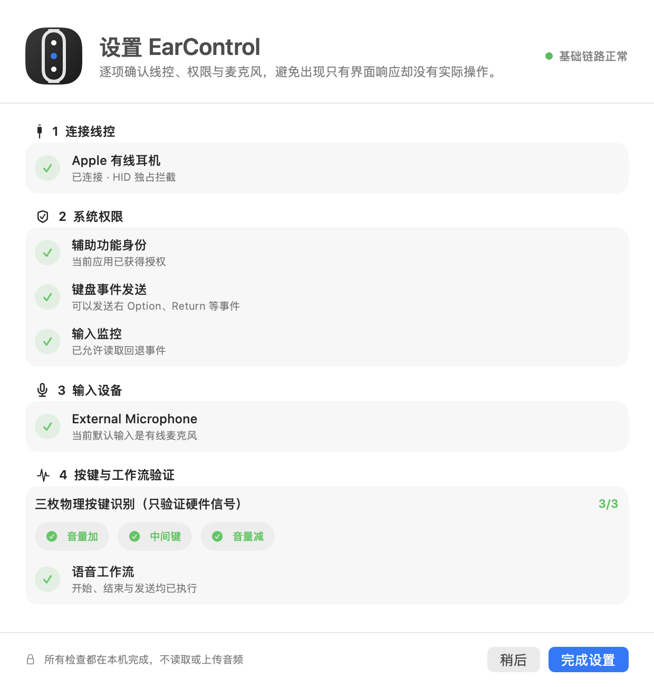

# EarControl

把 Apple 有线 EarPods 的三键线控变成 macOS 语音输入控制器。

[下载最新版](../../releases/latest) · [安装指南](docs/INSTALL.md) · [MIT License](LICENSE)



EarControl 面向微信输入法的“按住说话”工作流：用音量减开始说话，用中间键结束或执行自定义动作，再用音量加整理并发送。它直接读取耳机线控信号，不会改变系统音量，也不会误启动 Apple Music。

## 核心功能

| 线控操作 | 默认行为 | 可配置内容 |
| --- | --- | --- |
| 音量减 | 按住右 Option 或右 Command，开始语音输入 | 可选择右 Option / 右 Command |
| 中间键单击 | 结束语音 | 普通按键、组合快捷键或内置动作 |
| 中间键双击 / 三击 | 默认不执行额外动作 | 普通按键、组合快捷键或内置动作 |
| 中间键长按 | 全选并删除当前输入 | 固定保留，不参与自定义 |
| 音量加 | 结束语音、等待整理并发送 | 固定工作流 |

- **三键接管**：拦截 EarPods 原有的音量和播放行为，映射为完整语音工作流。
- **中键多击**：分别识别单击、双击、三击和长按，不会先触发较短手势。
- **组合快捷键**：可录制普通按键、单独的左右修饰键，以及 Command、Option、Control、Shift 组合键。
- **内置动作**：可直接选择“全选并删除”或“结束语音并发送”。
- **中断恢复**：系统弹窗终止语音后，再按一次音量减即可重新开始；切换桌面空间时会自动释放旧状态。
- **本机诊断**：检查耳机连接、系统权限、默认麦克风、三枚物理按键和完整语音工作流。

## 下载与安装

系统要求：**macOS 13 或更高版本**。

1. 前往 [Releases](../../releases/latest) 下载最新的 `.dmg`。
2. 打开 DMG，把 `EarControl.app` 拖入 `Applications`。
3. 从“应用程序”文件夹打开 EarControl。
4. 如果 macOS 阻止打开，请前往“系统设置 → 隐私与安全性”，点击“仍要打开”。

公开测试包使用稳定的 Apple Development 签名，但尚未经过 Developer ID 公证，因此首次打开仍可能需要手动确认。建议先把应用固定放在 `/Applications/EarControl.app`，再授予系统权限。

## 首次设置

### 1. 设置微信输入法

打开“微信输入法 → 语音输入”，把“按住说话”快捷键设置为：

- **右 Option**，或
- **右 Command**。

随后在 EarControl 的“设置 → 通用”中选择相同按键。选中的右侧修饰键会被微信输入法全局使用，日常快捷键建议使用对应的左侧修饰键。

### 2. 授予系统权限

- **辅助功能**：用于发送右 Option、右 Command、Return、Delete 和自定义快捷键。
- **输入监控**：仅在 HID 独占失败、EarControl 进入回退模式时需要。

EarControl 会分别验证“辅助功能身份”和“键盘事件发送”是否真正生效，不会只根据系统设置中的开关判断。

### 3. 连接并验证 EarPods

插入 Apple 有线 EarPods，按照首次设置页依次确认耳机、权限、麦克风、三枚按键和语音工作流。



## 默认使用方式

1. **按音量减**：开始语音输入并持续说话。
2. **按中间键**：结束语音；如果配置了多击映射，则执行对应快捷键或内置动作。
3. **按音量加**：结束仍在进行的语音，等待输入法整理，然后提交并发送。

如果语音已经结束，音量加会直接发送一次 Return；如果语音仍在进行，EarControl 会先释放触发键，等待约 1.2 秒整理，再发送两次 Return。

## 中键手势

| 手势 | 默认设置 | 说明 |
| --- | --- | --- |
| 单击 | 仅结束语音 | 等待 0.35 秒确认没有后续点击 |
| 双击 | 未设置 | 只执行双击动作，不执行单击 |
| 三击 | 未设置 | 第三次松开后立即执行 |
| 长按至少 0.8 秒 | 全选并删除 | 取消当前连击序列并清空输入 |

单击、双击和三击都可以绑定以下任意一种动作：

- 一个普通按键，例如 Space、Return、Delete 或 Escape；
- 一个组合快捷键，例如 `⌘⇧K`；
- 一个单独的左/右 Command、Option、Control 或 Shift；
- “全选并删除”；
- “结束语音并发送”。

每个手势只保存一个按键、一个快捷键组合或一个内置动作，不支持宏和多步按键序列。

## 语音中断恢复

macOS 弹窗、输入法自身状态变化或桌面空间切换可能终止正在进行的语音输入。

- **系统弹窗中断后**：再次按音量减。EarControl 会先释放旧触发键，等待 0.08 秒，再重新按下。
- **切换桌面空间后**：EarControl 会自动释放触发键并熄灭蓝色状态；返回后按一次音量减即可重新开始。
- **正常语音中再次按音量减**：同样会重新建立触发状态，不需要先按中间键结束。

## HID 是什么

HID 是 Human Interface Device（人机接口设备）的缩写。EarPods 的音量加、中间键和音量减会以 HID 信号发送给 Mac。

EarControl 会尝试独占读取匹配到的 Apple 有线耳机线控，从源头阻止原来的音量、播放和 Siri 行为。它只接管线控按键，不独占耳机的音频输入设备，因此不会影响麦克风录音。

## 隐私

- 所有连接、权限、麦克风和按键检查都在本机完成。
- EarControl 不录制、读取或上传语音内容。
- 程序只读取当前默认输入设备的名称，用于提醒语音是否可能使用了错误的麦克风。
- 诊断信息仅在应用内显示，除非用户主动复制，否则不会离开本机。

## 兼容范围

- macOS 13 或更高版本；
- Apple 有线 EarPods；
- 已验证微信输入法的右 Option / 右 Command“按住说话”快捷键；
- 部分第三方耳机、转接器或 HID 属性不同的设备可能无法被识别。

EarControl 只接管匹配到的 Apple `Headset / Audio` 线控，避免影响 Mac 键盘上的媒体键。

## 常见问题

<details>
<summary><strong>系统权限已经打开，但按键没有执行动作</strong></summary>

完全退出 EarControl，在“系统设置 → 隐私与安全性 → 辅助功能”中删除旧的 EarControl 项，重新添加 `/Applications/EarControl.app`，然后再次启动应用。

反复重新构建、移动应用或更换签名后，macOS 可能把它识别为新的授权对象。

</details>

<details>
<summary><strong>三枚物理按键显示 3/3，为什么映射仍然无效？</strong></summary>

`3/3` 只表示耳机的三枚 HID 信号已经被识别，不代表系统允许 EarControl 发送键盘事件。请同时确认“辅助功能身份”和“键盘事件发送”均为绿色。

</details>

<details>
<summary><strong>当前输入不是 External Microphone</strong></summary>

在 macOS 的声音输入设置中选择有线耳机麦克风。否则微信输入法可能实际使用 MacBook、iPhone、蓝牙耳机或其他输入设备。

</details>

<details>
<summary><strong>语音被系统弹窗打断，音量减看起来仍是蓝色</strong></summary>

再次按一次音量减即可。EarControl 会释放旧状态并重新触发语音输入，不需要先按中间键。

</details>

更多安装和权限处理方式请查看 [安装指南](docs/INSTALL.md)。

## 从源码构建

需要 Xcode Command Line Tools 或完整 Xcode。

```sh
git clone <repository-url>
cd EarControl
swift build
```

构建并签名 `.app`：

```sh
chmod +x build-app.sh
./build-app.sh
open dist/EarControl.app
```

构建 DMG：

```sh
chmod +x build-dmg.sh
./build-dmg.sh
```

运行测试：

```sh
swift test
```

公开 DMG 构建需要可用的稳定代码签名身份；脚本不会把临时签名应用作为公开安装包。

## 灵感与致谢

EarControl 的产品构想受到小红书作者 **宸轩书院** 分享的《VibeKeys——把耳机线控变成快捷键》启发：[查看原帖](https://www.xiaohongshu.com/explore/6a59c0e8000000001d00cfc0?xsec_token=CB5jyB_VmFTQaGNpH37kckDGQAQBCb1B9ydRUuDA8P3mA%3D&xsec_source=app_share)。

在这一思路基础上，EarControl 进一步实现了三键线控接管、中键单击/双击/三击、组合快捷键、自定义预设动作、权限检查与语音中断恢复等功能。

感谢宸轩书院分享这个巧妙的使用方式。

## 许可证

本项目采用 [MIT License](LICENSE)。
